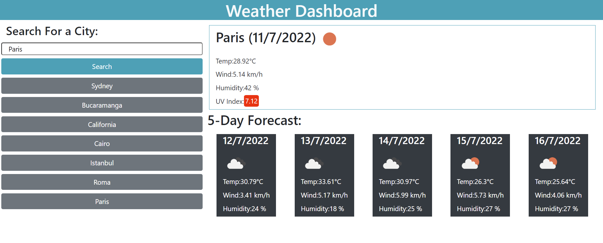

# Weather-Dashboard

## **This project was created for a traveler user to plan and organise their a trip depending of the city weather conditions.**
 
* The user can search for different cities.
* When the city is searched the weather conditions are presented and also a five day forecast.
* The information is displayed with: city name, date, an icon representation of weather conditions, the temperature, the humidity, the wind speed, and the UV index.
* The UV index is presented with a color that indicates whether the conditions are favorable (green), moderate (blue), or severe (red).
* The city is saved in a history list and when the user clicks the city button they can see the current date, an icon representation of weather conditions, the temperature, the wind speed, and the humidity.

💡 See live version here: [https://marcelamejiao.github.io/Weather-Dashboard/](https://marcelamejiao.github.io/Weather-Dashboard/)

### **Preview**

